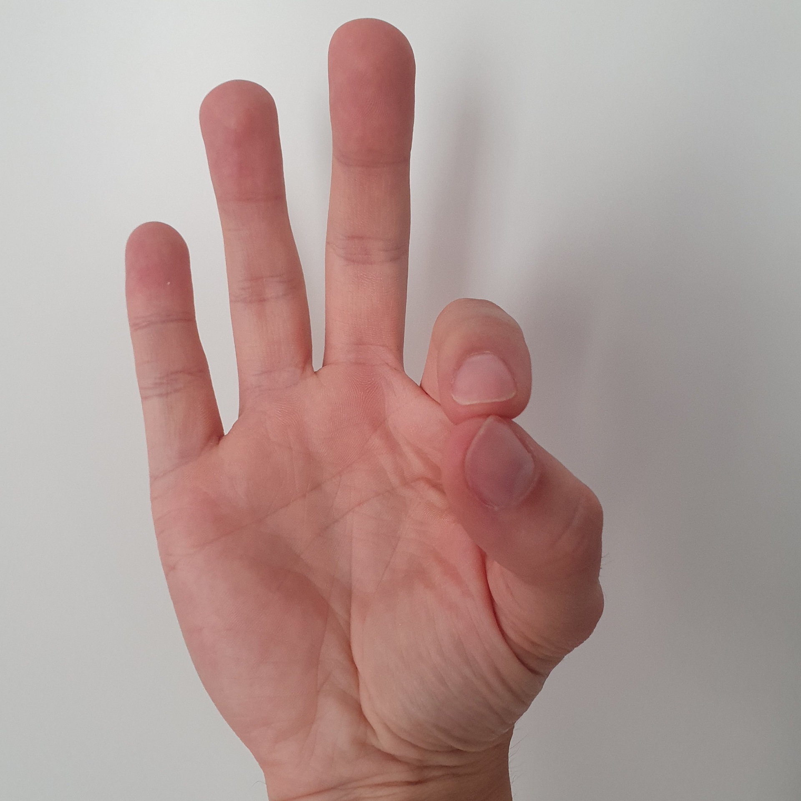
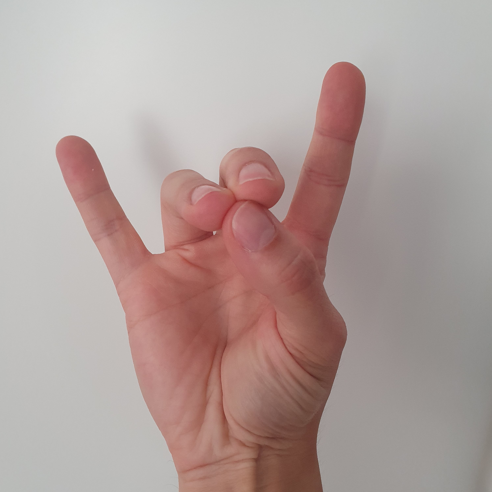
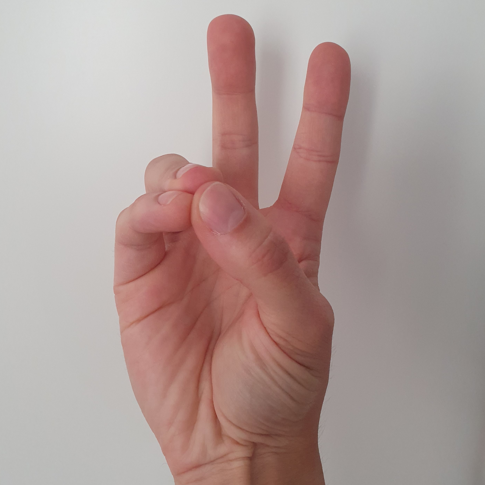
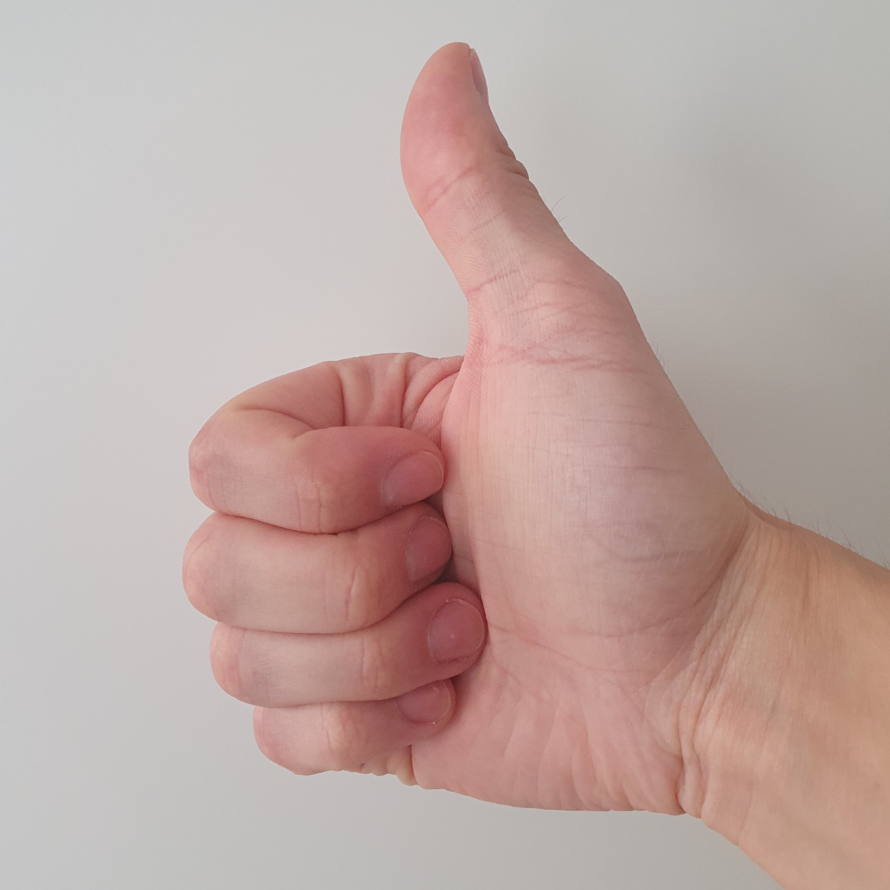
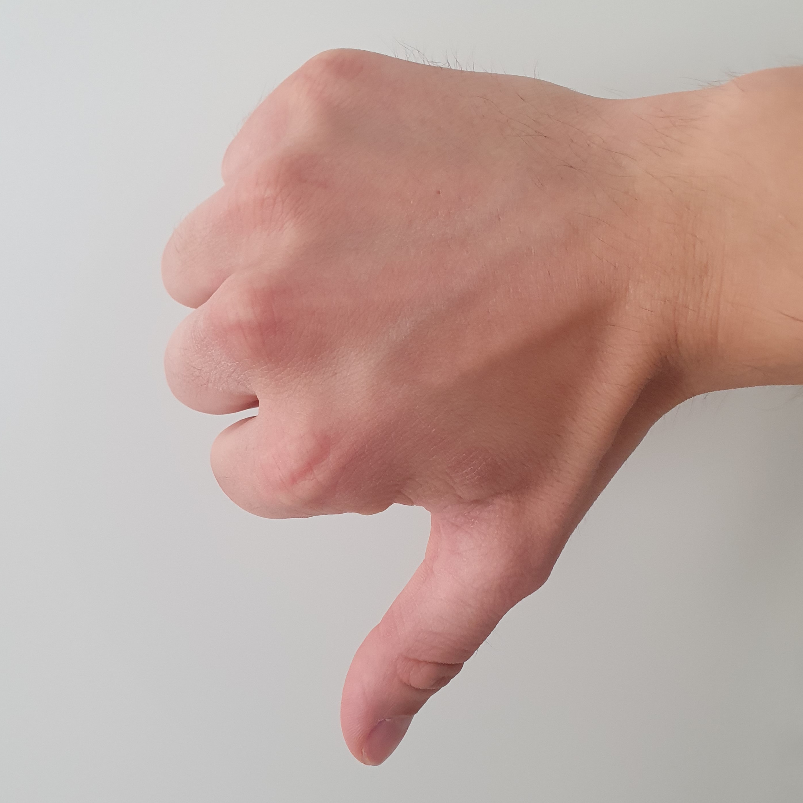

# DedoMouse
DedoMouse let's you control your computer mouse with your hands and a webcam.

Download [latest release](https://github.com/achimmihca/DedoMouse/releases/latest): 

- <ins>Left click</ins>: Move index finger near thumb. 
    
- <ins>Right click</ins>: Move middle and ring finger near thumb. 
    
- <ins>Middle click</ins>: Move ring finger and pinky near thumb. 
    
- <ins>Scroll up</ins>: Thumb up gesture. 
    
- <ins>Scroll down</ins>: Thumb down gesture. 
    
- <ins>Drag and Drop</ins>: Hold left click gesture for some time to start a mouse-drag. Release the gesture to end the mouse-drag. 

You can test these gestures in the app using the "Log" tab.
All recognized gestures are logged even if mouse control is disabled.

You can close the app anytime via keyboard shortcut `Ctrl+Shift+Alt+Escape`.
All shortcuts are configurable.

## Where to use
This remote control is useful for
- presentations (show next slide or image)
- simple browsing (e.g. start movie)
- reduced bacteria transfer (no need to touch an input device at an ATM or laboratory)
- people who cannot or do not want to use a regular mouse (e.g. because of pain due to RSI)

The gesture based remote control of DedoMouse allows you to take a step back from your desk
and reduce the time spent in uncomfortable positions.

## How it works
DedoMouse uses the hand and finger tracking of Google's [MediaPipe](https://google.github.io/mediapipe/solutions/hands).

## Development
DedoMouse is not under active development.

### Python Setup
- Install a recent version of Python (3.9.x or newer)
- Clone the repo and navigate to the project folder
- Create a virtual environment: `python -m venv env`
- Activate the virtual environment: `env/Scripts/activate.bat`
- Install dependencies: `pip install -r requirements.txt`
- Start `src/main.py`

There is also a launch configuration for Visual Studio Code.

### Code Style
This project uses 
- mypy for static code analysis (see `mypy.ini`).
- pylint for code style checks (see `.pylintrc`).

As a rule of thumb, Python conventions should be followed.

### Create Executable
Open a console in the virtual environment, then run

`pyinstaller main.spec`

This should create a folder named `dist` with the executable.

## License
DedoMouse itself is licensed under [MIT License](https://github.com/achimmihca/DedoMouse/blob/main/LICENSE).

However, licenses of the used libraries (see requirements.txt) differ.
- mediapipe: [Apache License v2.0](https://github.com/google/mediapipe/blob/master/LICENSE)
- opencv: [Apache License v2.0](https://github.com/opencv/opencv/blob/master/LICENSE)
- rxpy: [Apache License v2.0](https://github.com/Reactive-Extensions/RxPy/blob/master/LICENSE)
- screeninfo: [MIT](https://github.com/rr-/screeninfo/blob/master/LICENSE.md)
- keyboard: [MIT](https://github.com/boppreh/keyboard/blob/master/LICENSE.txt)
- mouse: [MIT](https://github.com/boppreh/mouse/blob/master/LICENSE.txt)
- jsonpickle: [BSD](https://github.com/jsonpickle/jsonpickle/blob/main/LICENSE)
- numpy: [NumPy License (similar to BSD)](https://numpy.org/doc/stable/license.html)
- pyside6: [LGPL/GPL v3.0](https://wiki.qt.io/PySide2)
    - Qt: [LGPLv3/GPL](https://www.qt.io/licensing/)

For development only:
- pylint: [GPL v2.0](https://github.com/rr-/pylint/blob/main/LICENSE)
- mypy: [MIT and others](https://github.com/python/mypy/blob/master/LICENSE)
- pyinstaller: [Custom GPL](https://github.com/pyinstaller/pyinstaller/blob/develop/COPYING.txt)

## Trivia
'Dedo' is Spanish and means 'finger'.
